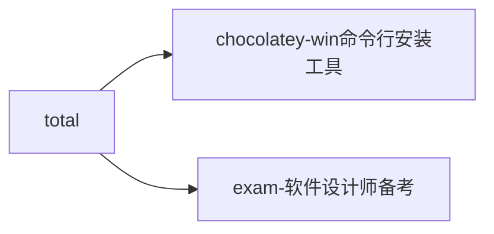

1. [chocolatey 配置与使用](chocolatey_config.md)
2. [软考备考](exam_config.md)

<pre class="mermaid">
graph LR;
total --> chocolatey-win命令行安装工具
	 click chocolatey-win命令行安装工具 "chocolatey_config.md"
total --> exam-软件设计师备考
	 click exam-软件设计师备考 "exam_config.md"
</pre>