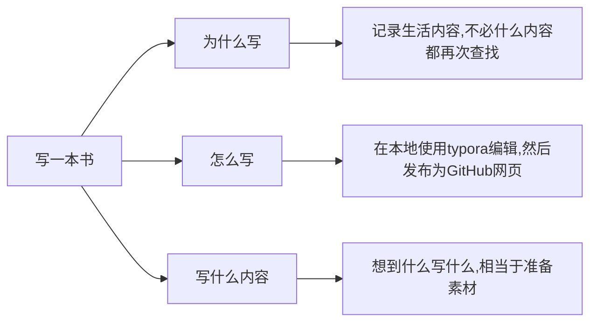

<!-- 加载mermaid，以便GitHub page 展示mermaid -->

想在GitHub画图展示，找到了神器mermaid，但是蛇皮的事情来了

mermaid的支持typora很棒，本地查看很好，GitHub也官方说明支持，readme文件展示毫无问题，但是经由GitHubPage发布为页面，啊哈，那就消失了，都是问题

Typora及Github Preview展示均异常，但是GitHub Pages渲染异常：

本地页面调试可用的html代码块：

<pre class="mermaid">
graph LR;
写一本书-->为什么写;
写一本书-->怎么写;
写一本书-->写什么内容;
为什么写-->记录生活内容,不必什么内容都再次查找;
怎么写-->在本地使用typora编辑,然后发布为GitHub网页;
写什么内容-->想到什么写什么,相当于准备素材;
</pre>

