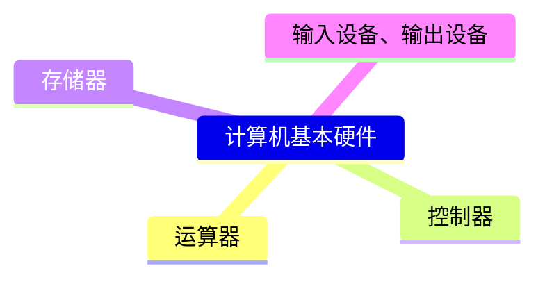

# 备战软考

<!-- 加载mermaid，以便GitHub page 展示mermaid -->

## 1、安排与计划

大约3月左右报名，5月左右考试。离目前大约4个月，准备好。

软考网站：[中国计算机技术职业资格网](https://www.ruankao.org.cn/)

`GitHub`资料：[2025年 软件设计师 （软考中级）](https://github.com/xiaomabenten/software_designer/)

计划前俩月先看书，700页左右（687页），大约一个月350页左右，每周90页的书，需要看完并总结。

<pre class="mermaid">
timeline
title 软件设计师备考计划
1月 : 阅读并总结书籍前350页
2月 : 阅读并总结书籍后350页
3月 : 做历年真题 : 报名考试
4月 : 做机考模拟试卷
5月 : 准备考试
</pre>

先做计划了，也不一定能特别顺利，早做准备。

实际也很现实，下班了只想玩只想休息，根本不想看，这么一想，和在大学其实也没什么两样，只能自己努力试试了。

## 整理

### 第一章、计算机基础知识

1.1计算机硬件基本组成

第二章、

第三章、

第四章、

第五章、

第六章、

第七章、

第八章、

第九章、

第十章、

第十一章、

第十二章、

