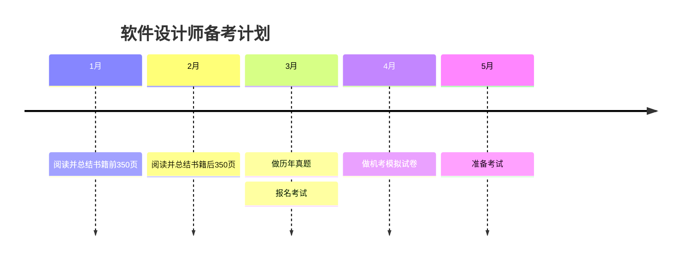

# 备战软考

## 1、安排与计划

大约3月左右报名，5月左右考试。离目前大约4个月，准备好。

软考网站：[中国计算机技术职业资格网](https://www.ruankao.org.cn/)

`GitHub`资料：[2025年 软件设计师 （软考中级）](https://github.com/xiaomabenten/software_designer/)

计划前俩月先看书，700页左右（687页），大约一个月350页左右，每周90页的书，需要看完并总结。

先做计划了，也不一定能特别顺利，早做准备。

