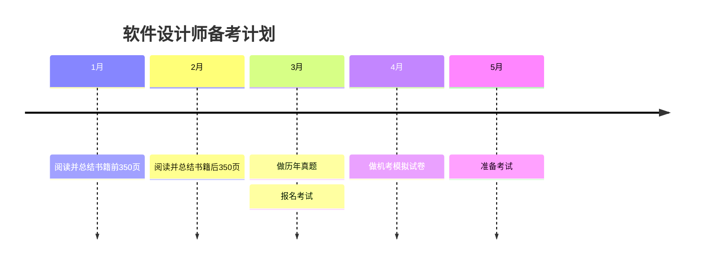
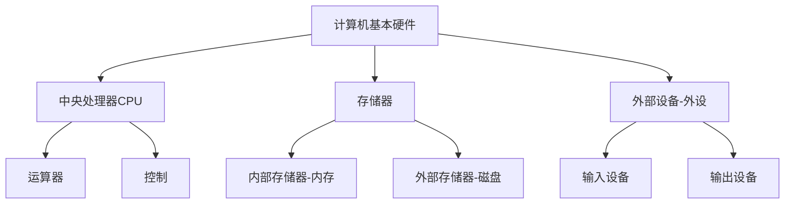
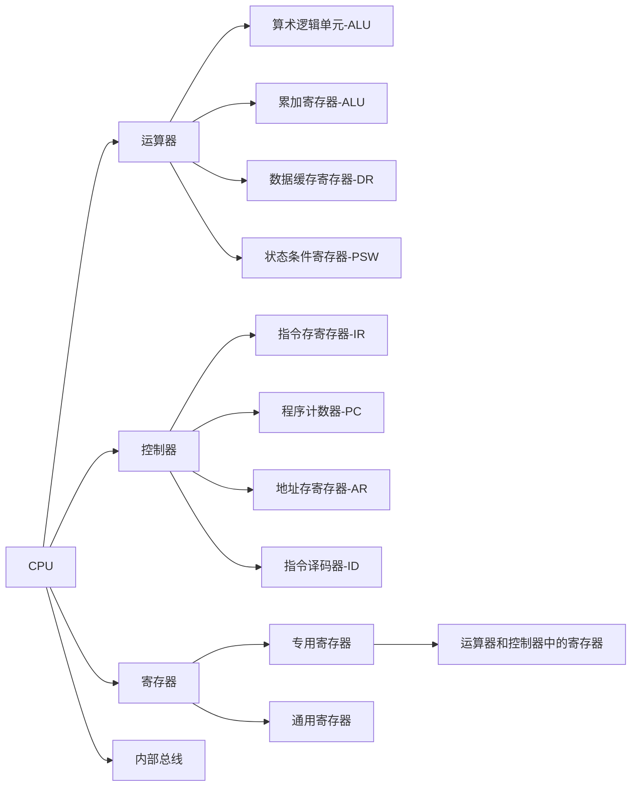
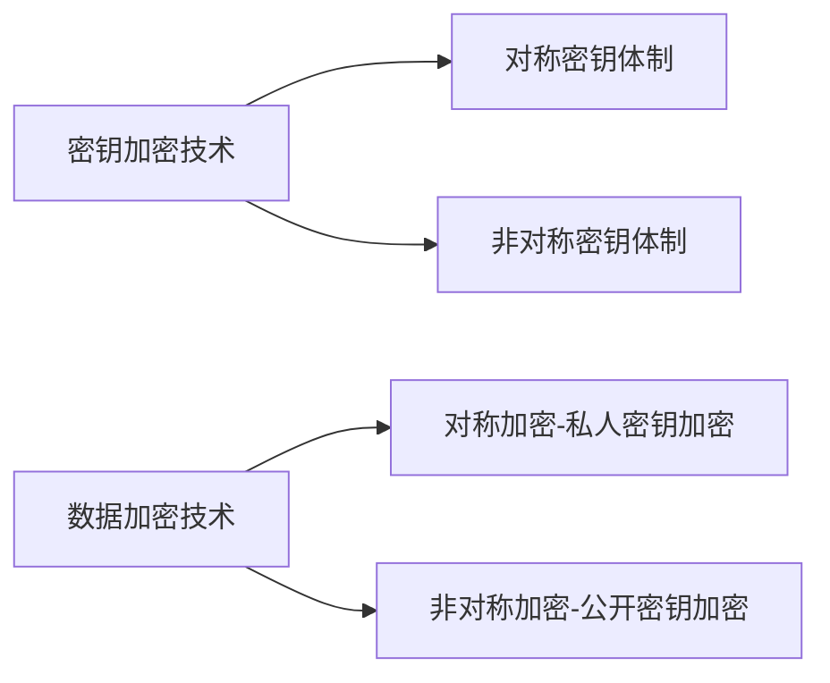

# 软件设计师备考

## 1、安排与计划

大约3月左右报名，5月左右考试。离目前大约4个月，准备好。

软考网站：[中国计算机技术职业资格网](https://www.ruankao.org.cn/)

`GitHub`资料：[2025年 软件设计师 （软考中级）](https://github.com/xiaomabenten/software_designer/)

计划前俩月先看书，700页左右（687页），大约一个月350页左右，每周90页的书，需要看完并总结。

先做计划了，也不一定能特别顺利，早做准备。

实际也很现实，下班了只想玩只想休息，根本不想看，这么一想，和在大学其实也没什么两样，只能自己努力试试了。

## 整理

### 第一章、计算机基础知识

1.1.1 计算机硬件基本组成

1.1.2 中央处理器-CPU

1.1.3 数据表示

1、原码、反码、补码和移码

- **原码**：原码是最直观的表示方法，它直接用二进制数表示一个数，包括正负号。在原码中，最高位（最左边的位）是符号位，0 表示正数，1 表示负数。其余位表示数值本身。例如，十进制数 +5 的原码表示为`0000 0101`，而 -5 的原码表示为 `1000 0101`。
- **反码**：反码主要用于表示负数。对于正数，其反码与其原码相同。对于负数，其反码是将原码除符号位外的所有位取反（0 变 1，1 变 0）。例如，十进制数-5的反码表示为`1111 1010`。
- **补码**：补码是计算机中最常用的表示方法，用于进行二进制加法运算。对于正数，其补码与其原码相同。对于负数，其补码是其反码**末位**加 1。补码的一个重要特性是，任何数的补码加上该数本身，结果总是 0。例如，十进制数 -5 的补码表示为 `1111 1011`。
- **移码**: 用作浮点运算的阶码，无论正数负数，都是将该原码的补码的首位(符号位) 取反得到移码。

> 分别计算机器字节长n等于8，给出+1,-1,+127,-127,+45,-45,+0.5,-0.5,+0,-0的原码、反码、补码、移码。

| 真值 |   原码   |   反码   |     补码     |     移码     |
| :--: | :------: | :------: | :----------: | :----------: |
|  +1  | 00000001 | 00000001 |   00000001   |   10000001   |
|  -1  | 10000001 | 11111110 |   11111111   |   01111111   |
| +127 | 01111111 | 01111111 |   01111111   |   11111111   |
| -127 | 11111111 | 10000000 |   10000001   |   00000001   |
| +45  | 00101101 | 00101101 |   00101101   |   10101101   |
| -45  | 10101101 | 11010010 |   11010011   |   01010011   |
| +0.5 | 0.100000 | 0.100000 |   0.100000   |   1.100000   |
| -0.5 | 1.100000 | 1.011111 | **1.100000** | **0.100000** |
|  +0  | 00000000 | 00000000 |   00000000   |   10000000   |
|  -0  | 10000000 | 11111111 | **00000000** |   10000000   |

2、定点数和浮点数(IEEE 764标准)

**IEEE 764标准进行单精度数值的计算**

1.1.4 校验码

1、奇偶校验码(`Parity Codes`)

​	在原始码流后面，加上校验位。它的校验位只有一位，要么是0，要么是1。并且它的校验码还可以放在码流的前面。统计这段数据流内是奇数个1还是偶数个1，当多个位同时变动则会误判。

2、海明码(`Hamming Code`)

​	可以校验错误，可以部分纠错。**海明码的计算与纠错**

3、循环冗余校验码（`CRC`）

​	仅可校验错误不能纠错

​	

1.3.2 加密技术和认证技术

对称加密算法（加密解密使用相同的密钥）

- 数据标准加密DES：DES主要用替换和移位的方法加密，每次加密对64位输入数据进行16轮编码
- 三重DES(3DES或TDEA)，在DES基础上采用三重DES
- RC-5（Rivest Cipher 5），1994年开发，已过时，易被破解
- 国际数据加密算法（IDEA），基于DES基础，类似与三重DES，密钥128位。IDEA加密标准有PGP系统使用
- 高级加密标准（AES）算法，AES基于排列和置换运算，可以使用128位，192位和256位密钥，并且用128位（16字节）分组加密和解密数据。

非对称加密技术（使用公钥加密，私钥解密，或私钥加密，公钥解密）

非对称加密的算法保密性更好，它消除了最终用户交换密钥的需要，但是加密、解密花费时间长、速度慢，不适于对文件进行加密，只适用于对少量数据进行加密。

- RSA

CA证书一般是非对称加密技术，目前广泛采用RSA加密

Hash函数与信息摘要

Hash函数提供了这样一种计算过程：输入一个长度不固定的字符串，返回一串长度固定的字符串（Hash哈希值）

信息摘要 MD5，对于特定文件MD5是一定的

1.3.3 计算机可靠性

1、计算机可靠性概述

计算机元器件可靠性有浴盆曲线，开始阶段，元器件工作处于不稳定期，失效率高，第二阶段，元器件进入正常工作期，失效率低，第三阶段，元器件开始老化，失效率又重新提高。

第二章、程序设计语言基础知识

1957年出现的 Fortran 第一个被广泛用来进行科学和工程计算的高级语言

2.1.1 程序设计语言的基本概念

1.低级语言和高级语言

低级语言：机器语言和汇编语言

高级语言：与人类使用的自然语言更接近的编程语言

2.1.2 程序设计语言的基本成本

程序设计语言的基本成本包括数据、运算、控制和传输。

1、程序设计语言的数据成分

数据成分指数据类型：常量与变量，全局量和局部量，具有存储类别、类型、名称、作用域和生存期等属性

第三章、 

第四章、

第五章、

第六章、

第七章、

第八章、

第九章、

第十章、

第十一章、

第十二章、

<!-- 加载mermaid，以便GitHub page 展示mermaid -->

<!-- 兼容GitHub -->

<!-- 访问量统计 -->
 | 访问量： 次