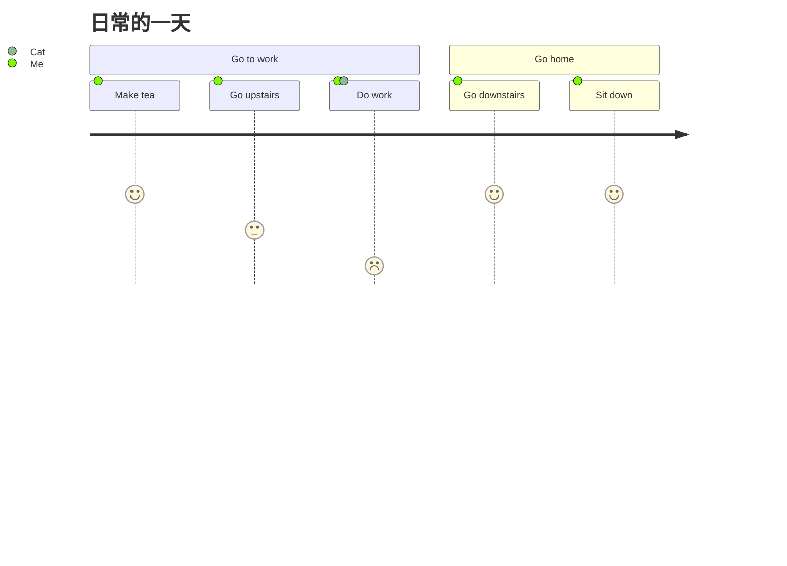

生活指南

> 好吧，这个是一个公共库，我写一些可用公开的

思考写什么内容

准备如无意外，不传入软件本体，仅必要的配置添加。

并且考虑图片是否添加，担心所有的图片都会会变得很大.wepb 格式可能会好些？

准备写这些文档，然后把它们变成书

卡牌生活
接收了昨日的弃牌堆卡牌 熬夜1点
打出了今日的抽卡 行动牌 俯卧撑16点

上午抽到了状态牌 特别困🥱10点
又打出了一次行动牌 俯卧撑16点

上午 抽卡食物牌 肉酱面 8点
解锁食物面条 煎鸡蛋🍳

中午 小吃一口 没啥食欲 因为没啥好吃的
遇到同事 吐槽一顿纳指

音乐 欧若拉 很好听的老歌

没睡好 整天都疲惫不堪

